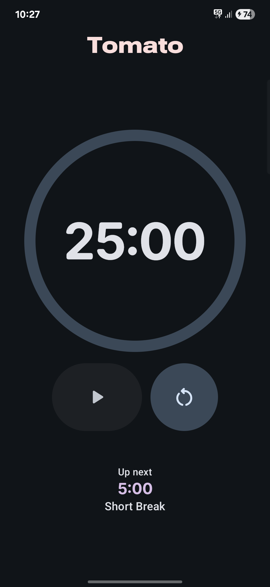
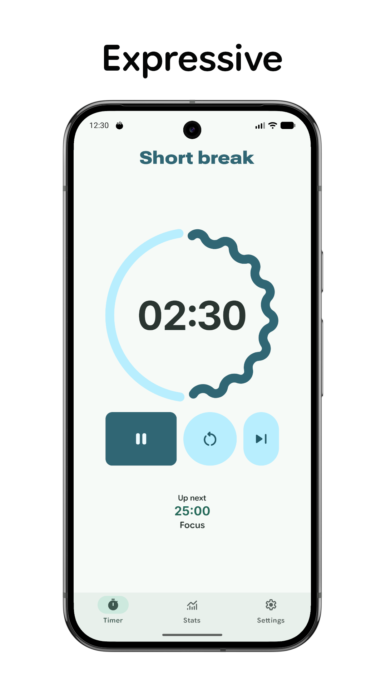
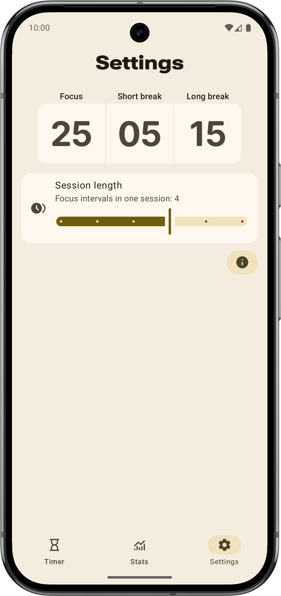
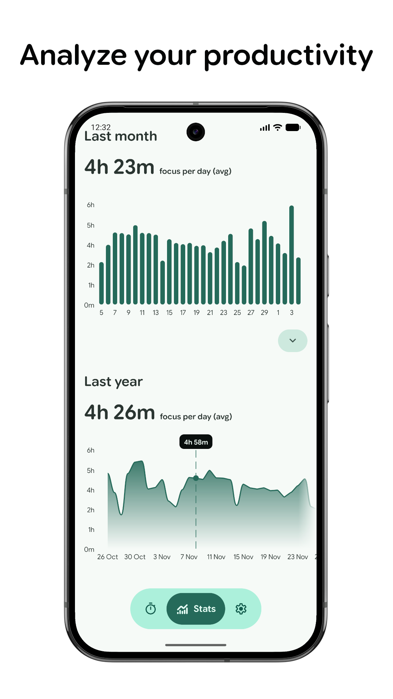
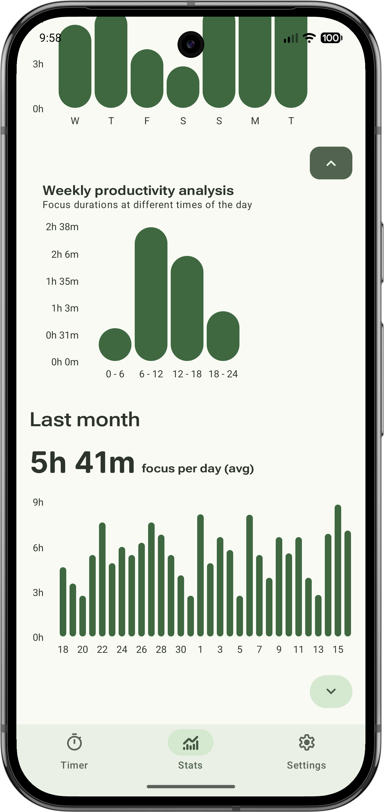
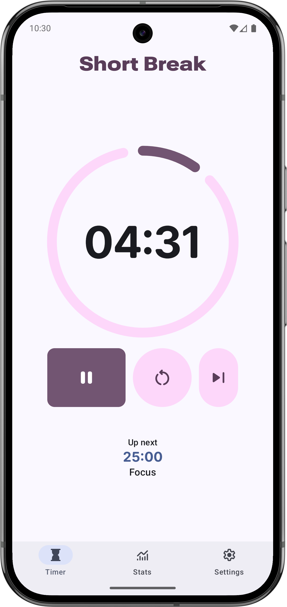

## About 🍅

---

<div align="center">

Tomato is a minimalist Pomodoro timer for Android based on Material 3 Expressive.

<p>
  <a href="https://apt.izzysoft.de/fdroid/index/apk/org.nsh07.pomodoro">
    
  </a>
</p>

</div>

---

## Screenshots

<p align="center" width="100%">
  
  
  
  
  
  
</p>

### Features

- Simple, minimalist UI based on the latest Material 3 Expressive guidelines
- Detailed statistics of work/study times in an easy to understand manner
    - Stats for the current day visible at a glance
    - Stats for the last week and last month shown in an easy to read, clean graph
    - Additional stats for last week and month showing at what time of the day you're the most
      productive
- Customizable timer parameters

## Download

- **F-Droid** (recommended): Tomato is not yet available on the official F-Droid repository.
  Instead, you can currently install it through
  the [IzzyOnDroid repository](https://apt.izzysoft.de/fdroid/).
- **Obtainium** (recommended): You can add this GitHub repository
  on [Obtainium](https://obtainium.imranr.dev/) to get updates directly from GitHub releases. This
  is the fastest way to install and update Tomato.
- **GitHub releases**: Alternatively, you can manually download and install APKs from
  the [Releases](https://github.com/nsh07/Tomato/releases/latest) section of this repo (This
  method is not recommended, use Obtainium instead).

> [!TIP]
> To [verify](https://developer.android.com/studio/command-line/apksigner#usage-verify) the APK
> downloaded from Obtainium/GitHub, use the following signing certificate fingerprints:
> ```
> SHA1: B1:4E:17:93:11:E8:DB:D5:35:EF:8D:E9:FB:8F:FF:08:F8:EC:65:08
> SHA256: 07:BE:F3:05:81:BA:EE:8F:45:EC:93:E4:7E:E6:8E:F2:08:74:E5:0E:F5:70:9C:78:B2:EE:67:AC:86:BE:4C:3D
> ```
> The SHA256 and MD5 hashes of the individual APK files are also available in the `checksum.txt`
> file for each release.

## Donate

You can support Tomato's development
through [my GitHub Sponsors page](https://github.com/sponsors/nsh07)
or [my BuyMeACoffee page](https://coff.ee/nsh07):

<a href="https://github.com/sponsors/nsh07">
  
</a>
<a href="https://coff.ee/nsh07">
  
</a>

## Special Thanks

This app was made possible by the following libraries:

- [Jetpack Navigation 3](https://developer.android.com/jetpack/androidx/releases/navigation3) -
  Navigation
- [Room](https://developer.android.com/jetpack/androidx/releases/room) - SQLite Database
- [Vico](https://github.com/patrykandpatrick/vico) - Graphs and charts