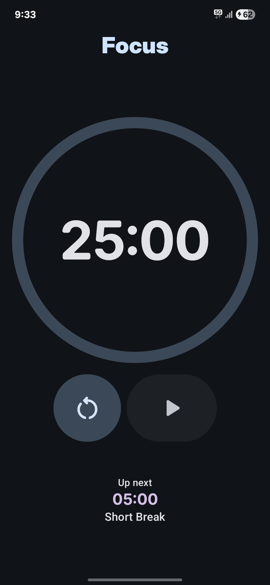
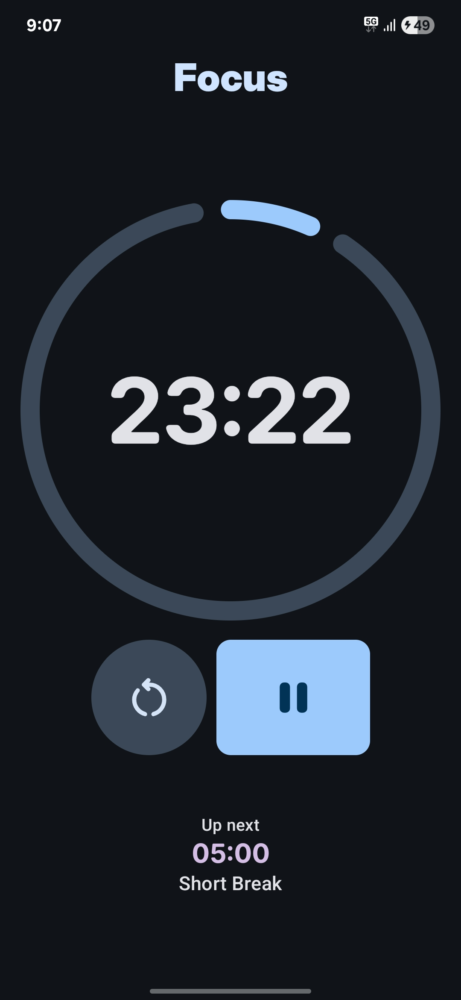
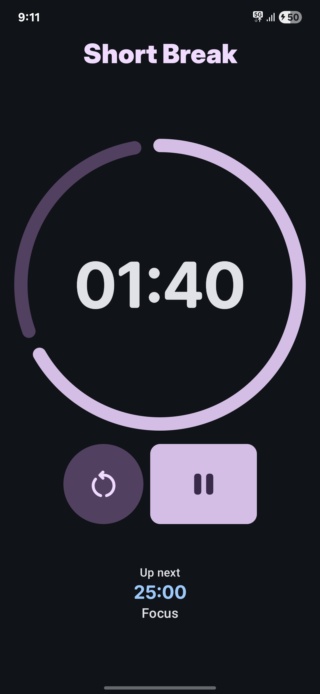
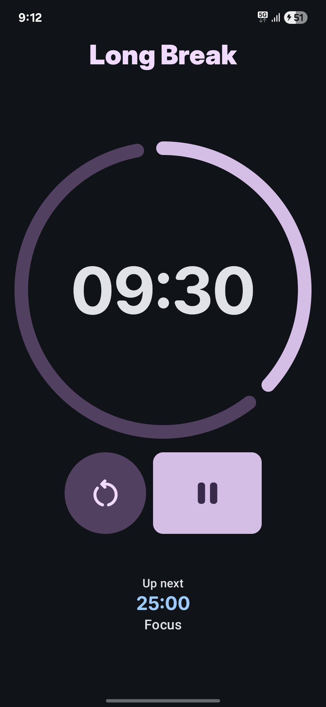

# Tomato

### THIS PROJECT IS IN A VERY EARLY DEVELOPMENT STAGE. MOST FEATURES ARE NOT YET READY

### About

Tomato is a minimalist Pomodoro timer for Android based on Material 3 Expressive

### Screenshots

  
  
  
  

