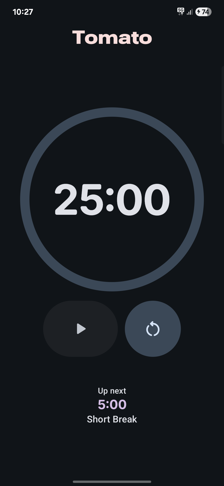
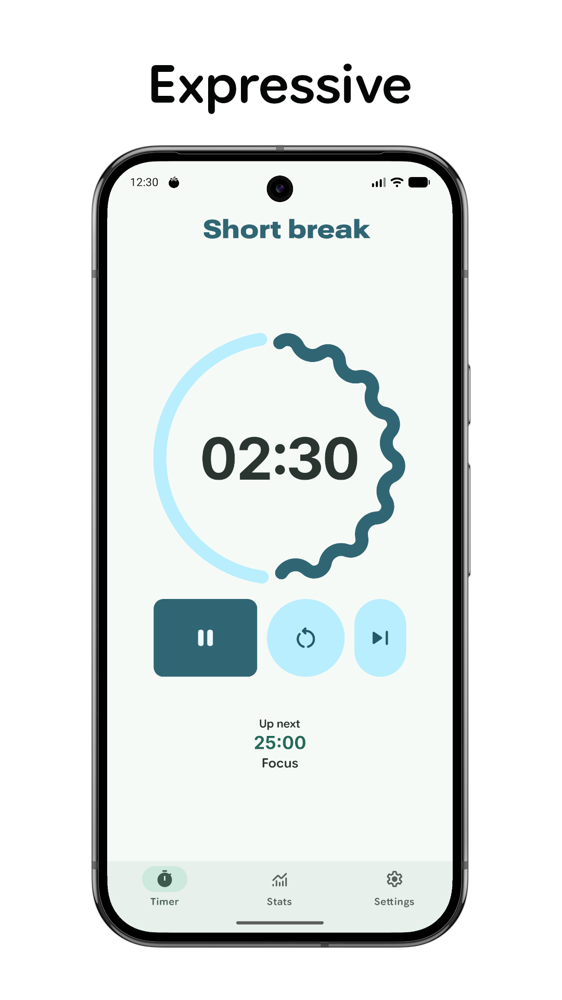
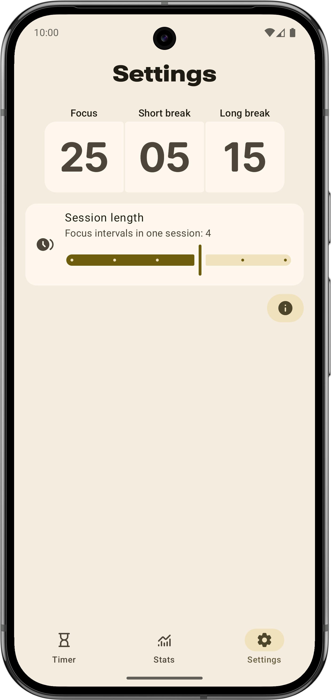
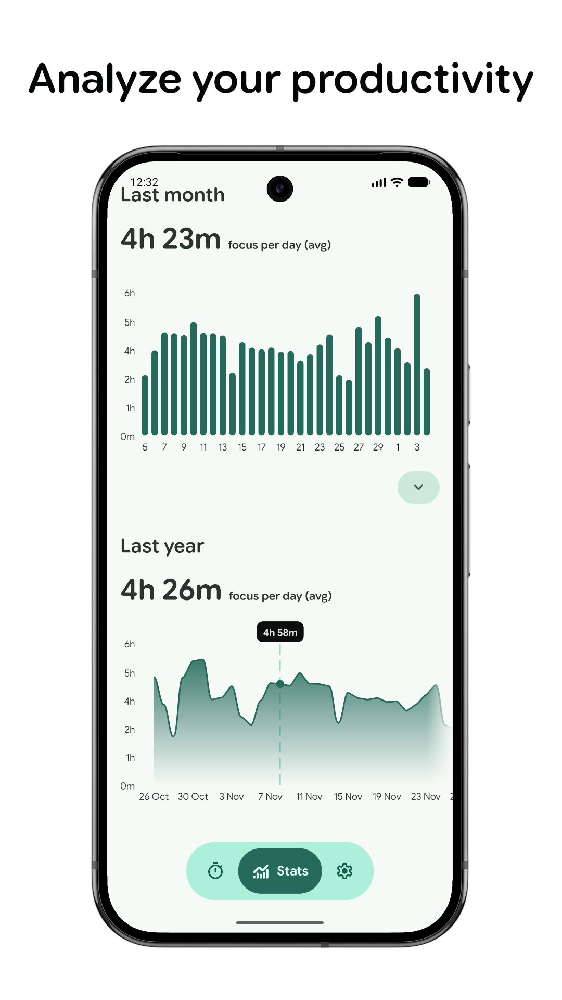
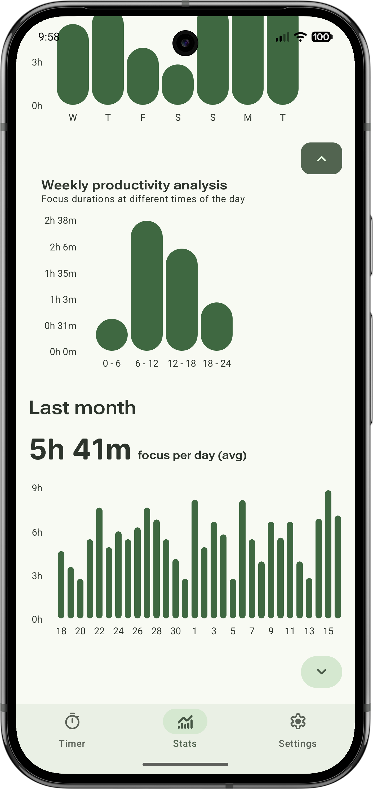
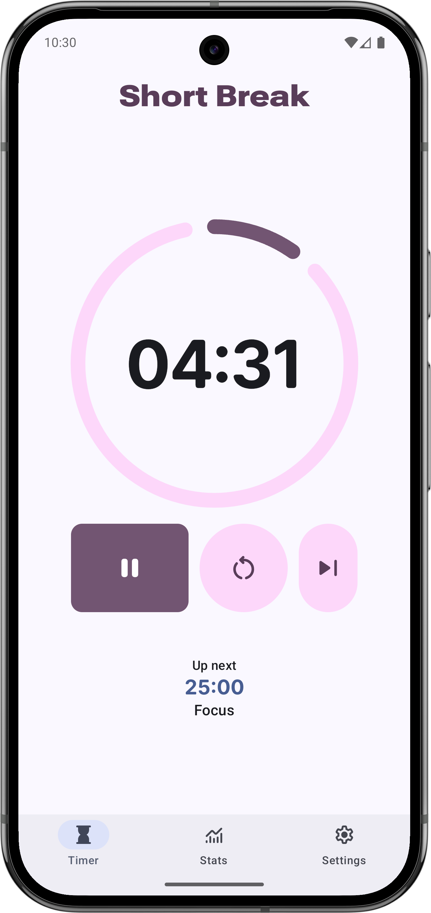
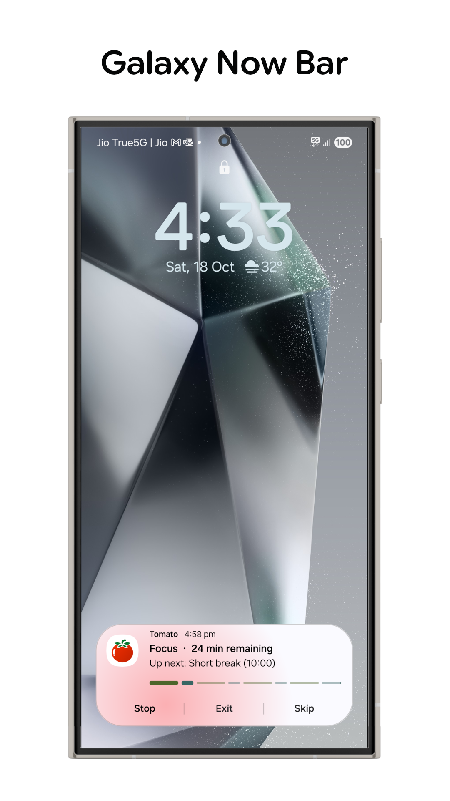
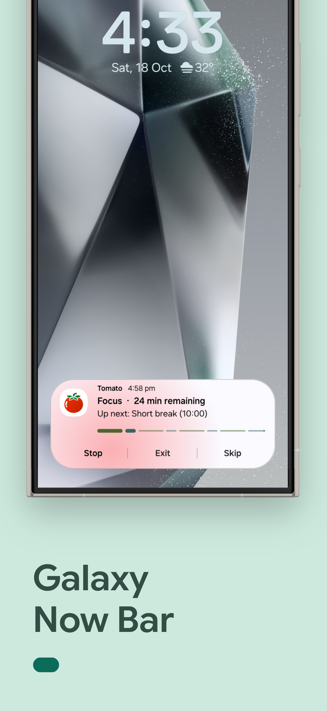
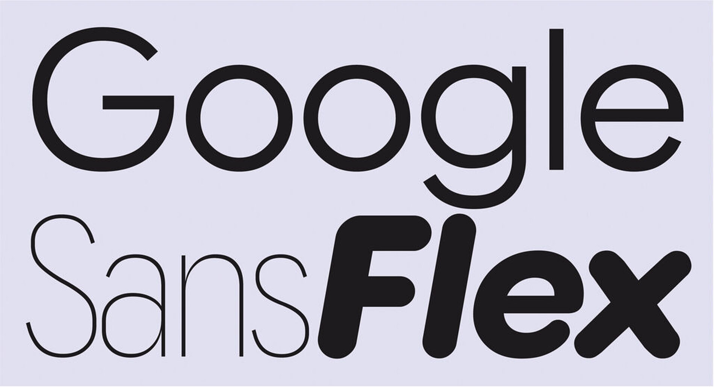

  

   🌐 Official Website of EHSAAN ULLAH
  

~ EHSAAN.ODOO.COM ~

  

    

---

## About

Tomato is a minimalist Pomodoro timer for Android based on Material 3 Expressive.

  
  
  

  

 

> *"It just might be the best looking timer app that I've ever seen"*

\- [*HowToMen* on YouTube](https://www.youtube.com/watch?v=iwvHk4SUrMQ&t=280s)

 

> *"... an app to support this habit helps me stay focused and get things done. Currently, that app
is Tomato."*

\- [*Android
Authority*](https://www.androidauthority.com/best-new-android-apps-october-2025-3602966/)

 

## Screenshots

### Features

- Minimalist UI based on the latest Material 3 Expressive guidelines
- Detailed statistics of work/study times in an easy to understand manner
    - Stats for the current day visible at a glance
    - Stats for the last week and last month shown in an easy to read, clean graph
    - Additional stats for last week and month showing at what time of the day you're the most
      productive
- Customizable timer parameters
- Support for Now Bar/Live Updates on Android 16 and later

## Translation

This project is [available on Hosted Weblate](https://hosted.weblate.org/engage/tomato/) for
translation.

You can contribute to this project even if you are not a developer by helping in
translating this project into languages you know.

### Members and Sponsors

- Shun Min Chang ([@jack24254029](https://github.com/jack24254029) on GitHub)
- Chinedu Oji (on BuyMeACoffee)
- Zach Alden (on BuyMeACoffee)

## Special Thanks

This app was made possible by the following libraries:

- [Jetpack Navigation 3](https://developer.android.com/jetpack/androidx/releases/navigation3) -
  Navigation
- [Room](https://developer.android.com/jetpack/androidx/releases/room) - SQLite Database
- [Vico](https://github.com/patrykandpatrick/vico) - Graphs and charts
- [MaterialKolor](https://github.com/jordond/materialkolor)- Material 3 color schemes

### Fonts:

- [Google Sans Flex](https://fonts.google.com/specimen/Google+Sans+Flex) by
  Google 

 

  

  

  

